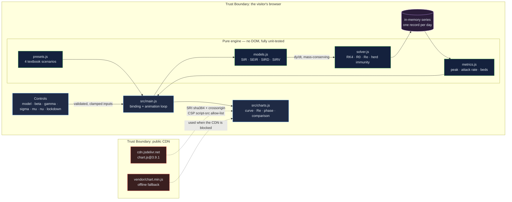

# Epidemic Modeling Dashboard: watch an intervention change the curve

[](https://github.com/Freddricklogan/epidemic-modeling-dashboard/actions/workflows/deploy.yml)
[](#5-getting-started--verification)
[](https://github.com/Freddricklogan/epidemic-modeling-dashboard/actions/workflows/codeql.yml)
[](LICENSE)
[](https://freddricklogan.github.io/epidemic-modeling-dashboard/)

## 1. Executive Summary & Business Impact

**Problem statement.** Compartmental epidemic models underpin public-health
decisions, and they are taught as differential equations most people never see
solved. The distance between `dS/dt = -beta*S*I/N` and "what happens if we close
schools on day 30" is where the intuition lives, and a static textbook cannot
cross it.

**Solution & value delivered.** Four compartmental models — SIR, SEIR, SIRD and
SIRV — integrated with a Runge–Kutta 4 solver in the browser, every parameter on
a live control. Turn on a lockdown and the peak flattens and Re crosses below 1
in the same frame. Four preset pathogens load textbook parameters in one click,
and a comparison panel runs all four models on identical inputs so the structural
differences are visible rather than described.

It is a **teaching instrument**. The data are synthetic and the parameters are
illustrative, not fitted — the interface says so in both places a reader looks.

## 2. Demonstrated Competencies & Technical Skills

- **Systems Architecture & CS** — A strict split between a pure engine
  (`src/models.js`, `solver.js`, `metrics.js`, `presets.js` — never touches the
  DOM) and a binding layer (`src/main.js`, `charts.js` — never computes). That
  boundary is what makes 100% statement coverage of the mathematics reachable.
- **Data Science & AI** — RK4 integration verified to fourth order against a
  closed-form solution; four models with mass conservation asserted in tests;
  basic and effective reproduction numbers; herd-immunity thresholds; phase-portrait
  trajectories; CSV export of the full daily series.
- **Cybersecurity & Compliance** — `default-src 'none'` CSP; the single CDN
  dependency pinned with an SRI hash computed against the artifact, plus a
  vendored offline fallback; no inline script, style or handlers; CodeQL and
  Trivy in CI.
- **EdTech & Human-Centered Design** — A five-step tour that performs real
  actions, `aria-live` on every changing metric, `role="img"` and labels on all
  four canvases, `aria-pressed` on the model tabs, `prefers-reduced-motion`
  respected.

## 3. System Architecture & Data Flow



No network calls leave the page. No backend, no account, no telemetry.

## 4. Technical Highlights & Engineering Decisions

### ADR-1 — Split the engine from the handler, because a name collision had broken both

**Context.** The previous build declared `function runSimulation(params)` (the RK4
engine) and `function runSimulation()` (the click handler) in one scope. Function
declarations hoist and the later one wins, so the handler called itself —
unbounded recursion on the first click of **Run**. Every control funnelled through
it, so the dashboard never drew a curve.

**Decision.** The engine became `simulate(params)` in `src/solver.js`; the handler
became `run()` in `src/main.js`. Separate modules make the collision impossible.

**Consequence.** The engine is callable from a test runner, which is how the other
six defects in `AUDIT.md` were found. The cost was a real refactor rather than a
one-line rename — worth it, because a rename would have fixed the crash and left
the mathematics unexamined.

### ADR-2 — Assert mass conservation in tests rather than trusting the equations

**Context.** The SIRV model lost people on every step: S shed `nu*S` while V
gained only `nu*efficacy*S`, and the force of infection differed between `dS` and
`dI`. Nothing in the UI surfaced it — the curves still looked plausible.

**Decision.** Every model is tested so the derivatives sum to within 1e-9 of zero,
and every simulation run is tested to hold the population within 0.1% over 100
days.

**Consequence.** A whole class of modelling bug now fails CI instead of shipping.
This is the check that would have caught the original defect the day it was
written, and it costs four assertions over a parameter sweep.

### ADR-3 — Pin the CDN, vendor a fallback, and keep frame-ancestors out of the meta tag

**Context.** `chart.js@3.9.1` was version-pinned but carried no `integrity`, so
nothing verified the delivered bytes, and a blocked CDN would have thrown.

**Decision.** Add the SRI hash computed from the downloaded artifact, vendor a
byte-identical copy, and fall back to it automatically. Omit `frame-ancestors`
from the CSP meta tag.

**Consequence.** Supply-chain risk is bounded by a hash and the demo survives an
offline or locked-down network. The `frame-ancestors` omission is deliberate:
Chromium ignores that directive in a meta tag **and logs a console error**, which
would fail the zero-console-errors bar for no security benefit. It works only as
a real response header, which Pages cannot set.

## 5. Getting Started & Verification

**Prerequisites.** Node 22 LTS (or any Node >= 20). No build step.

```bash
git clone https://github.com/Freddricklogan/epidemic-modeling-dashboard.git
cd epidemic-modeling-dashboard
npm install
npm run serve
```

**Verification — the numbers this repository actually produced:**

```bash
npm test         # Test Files 4 passed (4) · Tests 73 passed (73)
npm run coverage # All files 100% statements
npm run lint     # eslint . — clean
npm run validate # html-validate index.html — clean
```

| Check | Result |
| --- | --- |
| Unit tests | **73 passed / 73** across 4 files |
| Statement coverage (engine) | **100%** |
| ESLint | clean |
| html-validate | clean |
| Headless Chrome smoke | **0 console errors**, 0 failed requests; tour opens; SIRD reports 1.88% deaths; measles preset gives R0 7.20; animation advanced to day 49 |

Coverage is measured over the pure engine. `src/main.js`, `src/charts.js` and
`src/exec-shell.js` are binding layers, excluded from the target and covered by
the browser smoke test instead.

## 6. Live Demo & Production Showcase

**<https://freddricklogan.github.io/epidemic-modeling-dashboard/>**

No account, no credentials, no backend.

**30-second guided walkthrough.** Press **Take the 30-second tour**; all five
steps perform the action they describe.

1. **Choose a model** — switches to SEIR, adding a latent stage between infection
   and infectiousness.
2. **Load a scenario** — loads measles, the most transmissible preset (R0 7.20 at
   the shipped parameters).
3. **Read R0** — beta/gamma, with the herd-immunity threshold it implies on the
   bar below.
4. **Intervene** — switches on a lockdown from day 30 at 60% contact reduction and
   re-runs. The peak flattens and Re falls below 1.
5. **Compare all four** — the same parameters through every model at once.

Prefer to drive it yourself: set a lockdown day and reduction, press **Run**, then
scrub the timeline. **Export CSV** gives you the full daily series including Re.

> **Deployment note.** Pages serves `index.html` from the repository root via
> `.github/workflows/deploy.yml`. **Settings → Pages → Source must be set to
> "GitHub Actions"** for the workflow to publish.
